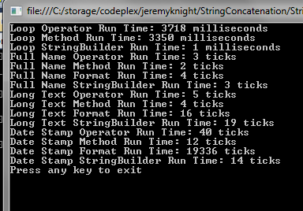
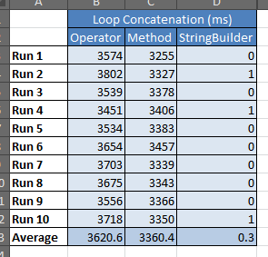
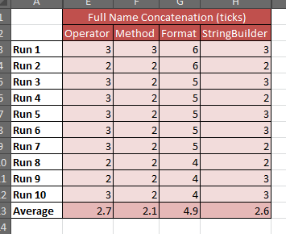
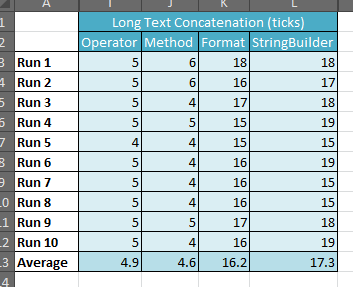
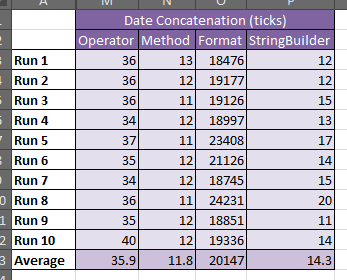

String concatenation is a tool on every developer’s tool belt but in .NET there are multiple ways to accomplish it. There are also a lot of conflicting articles, posts, etc. on the subject. When should you use StringBuilder? When should you use string formatting? This article will hopefully shine some light on when to use each method.

## Which Methods Were Tested?

- The concatenation operator. In C#, it is the + operator. In VB.NET, it is the & operator.
- The [String.Concat()](http://msdn.microsoft.com/en-us/library/system.string.concat.aspx "String.Concat Method") method.
- The [System.Text.StringBuilder](http://msdn.microsoft.com/en-us/library/system.text.stringbuilder.aspx "StringBuilder Class") class.
- The [String.Format()](http://msdn.microsoft.com/en-us/library/system.string.format.aspx "String.Format Method") method.

## How Were They Tested?

A console application was prepared to test operation scenarios. The scenarios were timed using the [System.Diagnostics.Stopwatch class](http://msdn.microsoft.com/en-us/library/system.diagnostics.stopwatch.aspx "Stopwatch Class"). The full Visual Studio solution can be found in [my CodePlex project](http://jeremyknight.codeplex.com/ "Jeremy Knight - Code samples, snippets, etc from my personal blog.").

## What Were the Results?

**Scenario 1: Loop Concatenation**

The Loop Concatenation scenario was built to test string concatenation within a loop. This data set had the most straight-forward results. The StringBuilder class gives the best performance when using concatenation in this scenaraio.

\[caption id="attachment\_828" align="aligncenter" width="295"\] Loop Concatenation Results (in milliseconds)\[/caption\]

Code sample using StringBuilder in this scenario:

\[sourcecode language="csharp"\] var builder = new StringBuilder();

for (int i = 0; i < this.iterations; i++) { builder.Append("x"); }

var testString = builder.ToString(); \[/sourcecode\]

**Scenario 2: Full Name Concatenation**

The Full Name Concatenation scenario was built to test simple string concatenation in which few concatenations occur. It concatenates first name, a space, and last name. This is commonly used to build display names for a UI. These results point to the String.Concat method as the most efficient way to concatenate small numbers of strings.

\[caption id="attachment\_826" align="aligncenter" width="355"\] Full Name Concatenation Results (in ticks)\[/caption\]

Code sample using String.Concat in this scenario:

\[sourcecode language="csharp"\] string first = "John"; string last = "Deaux"; string fullName = string.Concat(first, " ", last); \[/sourcecode\]

**Scenario 3: Long Text Concatenation**

The Long Text Concatenation scenario was built to test long concatenations in which many concatenations occur. It simulates building the body of an email message. These results also point to the String.Concat method as the most efficient. Comparing the prior scenario with this scenario you can begin to see pattern. As you add concatenations, the efficiency of String.Format and StringBuilder (when out of a looping scenario) declines.

\[caption id="attachment\_827" align="aligncenter" width="353"\] Long Text Concatenation Results (in ticks)\[/caption\]

Code sample using String.Concat in this scenario:

\[sourcecode language="csharp"\] string newLine = System.Environment.NewLine; string name = "John Deaux"; string email = "john.deaux@123.me"; string subject = "The Subject of the Message"; string product = "ABC"; string feature = "XYZ"; string body = "The comment(s) made about product/feature.";

string\[\] values = new\[\] { "Name: ", name, newLine, "Email: ", email, newLine, "Subject: ", subject, newLine, "Product: ", product, newLine, "Feature: ", feature, newLine, "Message: ", newLine, body };

var emailBody = string.Concat(values); \[/sourcecode\]

**Scenario 4: Date Concatenation**

The Date Concatenation scenario was built to test the formatting of dates. It formats a date into the sortable format of 2011-12-31T15:30:15. Of the people I've talked to about this little experiment, this one has surprised the most. Why? Because it is highly touted by articles, books, and even Microsoft as the way to format data and it's _extremely_ inefficient. The String.Format method is slower and less efficient than every other method tested, including the StringBuilder class, for formatting DateTime objects as strings.

\[caption id="attachment\_825" align="aligncenter" width="347"\] Date Concatentation Results (in ticks)\[/caption\]

Code sample using String.Concat in this scenario:

\[sourcecode language="csharp"\] DateTime date = DateTime.Now;

var values = new\[\] { date.Year.ToString("0000"), "-", date.Month.ToString("00"), "-", date.Day.ToString("00"), "T", date.Hour.ToString("00"), ":", date.Minute.ToString("00"), ":", date.Second.ToString("00") };

var sortable = string.Concat(values); \[/sourcecode\]

Yes, you did read that correctly. The above code is _a lot_ faster and more efficient than:

\[sourcecode language="csharp"\] var sortable = string.Format("{0:u}", DateTime.Now); // or var sortable = string.Format("{0:yyyy-MM-ddTHH:mm:ss}", DateTime.Now); \[/sourcecode\]
